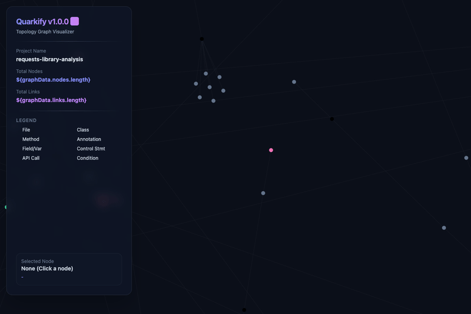

# Quarkify v1.0.0 ⚛️

> **"Everything is a folder" Philosophy — Local-First Static Analysis Engine & Source Code Topology Map Builder**

Quarkify is a configuration-driven static analysis engine that parses complex source code and materializes its structure into a physical directory tree. It creates an **AI-Ready Code Map** that allows AI coding agents (LLMs) to navigate and analyze massive codebases locally without opening files, while helping human developers easily grasp project architecture at a glance.

---

## 🎨 Core Identity & Philosophy

### 📁 Everything is a folder
Quarkify does not rely on abstract metadata files like JSON. It materializes every class, method, field, and even control flow statements into **pure physical directory paths**.
By turning the filesystem itself into a structured codebase knowledge database, Quarkify integrates seamlessly with powerful Unix-like CLI utilities such as `ls`, `tree`, `fd`, `find`, and `rg`.

### 💻 Local-First Design
Specifically optimized for the **developer's local machine and terminal interface**, rather than remote cloud transfers or sandboxed execution spaces. It is designed to let developers and local AI agents traverse local directories to isolate code scope with maximum speed and zero network overhead.

### 🤖 Mind-Blowing Synergy with AI Coding Agents (LLMs)
The physical directory topology map created by Quarkify unleashes **incredible speed and correctness** when combined with state-of-the-art AI agents (e.g., Antigravity, Claude, GPT).
* **Save Over 90% in Token Costs**: No need to feed giant source files or whole projects into the LLM context. The AI can simply check the quark directory paths and target-jump (`cd` or `ls`) directly into the exact class or method folder, keeping context sizes minimal and saving immense token bandwidth.
* **0% Hallucination**: Because the quark layout is materialized as real OS filesystem folders rather than abstract schema JSON, the LLM is fundamentally prevented from misinterpreting or hallucinating the layout of the project.
* **Lightning-Fast Iteration**: AI agents leverage standard CLI commands (`fd`, `tree`) to immediately comprehend the call dependencies (`_axon`) and symbol categorizations (`by_role`), yielding highly precise edits in seconds.

---

## ✨ Key Advanced Features

* **Python Support & Runtime Versioning**: Since Python has strong runtime dependencies, Quarkify dynamically queries and writes the current interpreter version inside a `python_version__[version]` directory inside the file quark.
* **Indentation-Based Python Statement Parser**: Parses indentation-based Python syntax recursively and maps decorators, classes, functions, and control blocks (if, for, try-except-finally) into distinct folder nodes.
* **TypeScript & JavaScript CStyle Parser Extension**: Deconstructs arrow functions (`const fn = () => ...`), class members, static properties, and asynchronous (`async`) declarations recursively into hierarchical directories.
* **Spring Framework & Java Annotation Materialization**: Decomposes class, method, and field annotations (e.g., `@RestController`, `@Autowired`, `@GetMapping("/api")`) along with their arguments into structured `annotation__` folders.
* **Try-Catch-Finally Block Deconstruction**: Breaks down exception handling flows into individual physical directories under `stmt__try` representing the main `body`, resource initializers (`resource`), exception signatures (`catch___Exception`), and `finally` blocks.
* **Built-in Glob Pattern Autoscan**: Support wildcard patterns like `**/*.java` or `src/**/*.ts` inside `sourceFiles` to recursively scan the local directory and build physical folder structures for all matched files in one execution.

---

## 📊 Real-world Open-source Benchmarks

Quarkify has been successfully tested on several large-scale open-source and enterprise repositories, proving its scalability and physical node-building correctness.

1. **Project Lombok (Java)**
   * **⚛️ Quark Folders**: **`55,913`** physical directories generated.
   * Materialized massive compiler AST-modifying logics and multi-annotation handlers.
2. **Hoppscotch (TypeScript/JavaScript)**
   * **⚛️ Quark Folders**: **`15,402`** physical directories generated.
   * Validated robust parser handling for TypeScript interfaces, classes, arrow function states, and class field properties.
3. **Python Requests (Python)**
   * **⚛️ Quark Folders**: **`6,726`** physical directories generated.
   * Verified Python environment metadata auto-detection (`python_version__3_14_5`) and decorator mapping.
4. **H2 Database (Java)**
   * **⚛️ Quark Folders**: **`15,134`** physical directories generated.
   * Deconstructed massive relational database kernel and file engine layouts. Successfully verified deconstruction for the massive, switch-dense `Parser.java` containing over 460 methods.

---

## 🌐 D3.js Force-Directed Interactive Graph (`index.html`)

Upon completion, a dark-themed visualizer dashboard **`index.html`** is generated at the root of the output directory:



* **Interactive Network Map**: Built using D3.js Force-Directed Layout. Visualizes the parsed quarks and inter-dependencies (`_axon` links) as an interactive network graph in the browser.
* **Local-First Standalone File**: All topological data is embedded directly into the HTML file. It runs instantly inside any modern web browser by double-clicking the file — no local server required.
* **Optimized Zoom & Focus**: Clicking on a node centers the graph and isolates related parent classes and caller methods.

---

## 🗂️ Output Directory Layout

Once analysis completes, Quarkify physically creates three core folders, a D3 visualizer, and an AI guide under the configured output directory:

* **`quark/`**: The raw source code decomposed recursively into class, method, field, and statement directories.
* **`_mirror/`**: Categorized symbolic links grouping quarks by kind (`by_kind`), project-specific role (`by_role`), and file (`by_file`) for multi-dimensional querying.
* **`_axon/`**: Inter-connectivity links mapping quarks back to their mirror categories, along with an opcode site registry (`by_opcode`).
* **`index.html`**: Standing D3 Force-Directed UI dashboard for visual topology exploration.
* **`ai_context_guide.txt`**: Guide directives instructing local AI coding agents (LLMs) to leverage quarks to minimize token waste and pinpoint source scopes.

---

## 🛠️ Supported Languages

* **TypeScript & JavaScript** (`.ts`, `.js`, `.tsx`, `.jsx`) - *Supports arrow functions, classes, interfaces, async declarations, and class field properties.*
* **Python** (`.py`) - *Supports runtime version auto-detection, decorator parsing, and indentation-based statement (try-except-finally, if, for) deconstruction.*
* **Java** (`.java`) - *Supports Spring Boot annotations & advanced try-catch-finally block deconstruction.*
* **Zig** (`.zig`)
* **CUDA C++** (`.cu`, `.cuh`)
* **C / C++** (`.cpp`, `.cc`, `.cxx`, `.h`, `.hpp`)
* **Metal MSL** (`.metal`)
* **CUDA Assembly PTX** (`.ptx`)
* **Objective-C / Objective-C++** (`.m`, `.mm`)

---

## 🚀 Getting Started

### 1. Requirements
* [Node.js](https://nodejs.org/) v22.12.0 or higher

### 2. Create Configuration File
Create a config file (`configs/*.mjs`) mapping source files and project-specific categorization.

```javascript
// configs/spring_analysis.mjs
export default {
  name: 'spring-demo-analysis',
  srcDir: '/path/to/spring-project',
  outDir: '/path/to/output_dir',

  // Use wildcard Glob patterns to scan files recursively
  sourceFiles: [
    'src/main/java/**/*.java',
  ],

  perfData: {},

  // Define classification rules based on symbol names
  guessRole(name) {
    const n = name.toLowerCase();
    if (n.includes('controller') || n.includes('session')) return 'web_endpoint';
    if (n.includes('service')) return 'business_logic';
    return 'general';
  },
};
```

### 3. Run Quarkify
Execute Quarkify with your config file as the argument:

```bash
node quarkify.mjs configs/spring_analysis.mjs
```

---

## 🔍 CLI Exploration Examples (The Value of "Everything is a folder")

Query the topologically materialized directory trees to inspect project logic without opening raw code:

```bash
# 1. Visualize GetMapping endpoint and try-catch control flow of 'getUser' method
tree output_dir/quark/file__SpringTestController.java/class__SpringTestController/fn__getUser

├── annotation__GetMapping/
│   └── arg__0____users__id_/
└── stmt_0__try/
    ├── body/
    │   └── stmt_0__return/
    ├── catch___IOException_e/
    └── finally/

# 2. Find every statement calling 'equals' API across the project
fd -t d "call__equals" output_dir/quark

# 3. Check every class/method assigned to 'web_endpoint' role
ls output_dir/_mirror/by_role/web_endpoint

# 4. Check the auto-detected Python interpreter version metadata
ls output_dir/quark/file__api.py/python_version__*

# 5. Check every TypeScript/JS quark assigned to 'state_store' role
ls output_dir/_mirror/by_role/state_store
```
